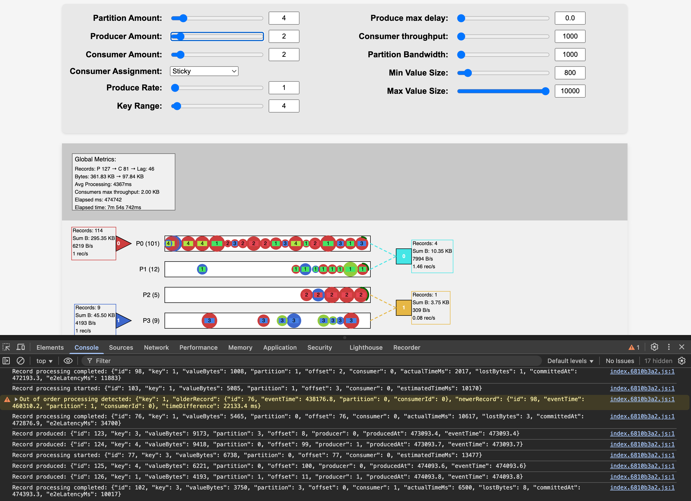

# Kafka-like Stream Processing Simulation

This project simulates a Kafka-like distributed streaming system with Producers, Partitions, and Consumers. It visualizes how data flows through the system and provides real-time metrics on performance.
It's useful to understand how records flow within the system and distribute across Consumers.



## License and author
❤️ Created by [Renato Mefi](https://www.linkedin.com/in/renatomefi/)

Sponsored by [Evoura](https://evoura.com/) - Data Streaming and EDA experts consultancy

This project is licensed under [CC BY-NC 4.0](LICENSE.md) - feel free to use and modify it for non-commercial purposes, but credit must be given to the original author.

This project was created with Claude 3.7 as a way of learning it, it looks hundreds of messages to get to this state, the code does not represent the author normal style of code as it's 99% AI generated with guidance on code style.

# Run

```
$ npm start
```

Visit [http://localhost:1234](http://localhost:1234)

# Key features

## Disclaimer
It's not an exact Kafka engine copy, for many reasons.
The code is meant to provide the minimum set of Kafka-like functionalities in order to provide a meaningful visualization while having key properties like ordering, partitioning, consumer assignment, etc.
It's not representative of real world scenarios, however can get enough visibility into possible issues that are applicable to real scenarios.

## Ordering issues Detection

The simulation tracks and detects ordering issues:
- Records with the same key should be processed in order of their event time
- When records with the same key are processed out of order, a warning is logged
- This helps visualize the ordering guarantees (or lack thereof) in distributed stream processing

## Configuration Options

Key configuration parameters:
- `partitionsAmount`: Number of partitions in the system
- `producersAmount`: Number of producers generating records
- `consumersAmount`: Number of consumers processing records
- `producerRate`: Records per second each producer generates
- `producerDelayRandomFactor`: Random factor for producer delays (0-1)
- `recordValueSizeMin`: Minimum record size in bytes
- `recordValueSizeMax`: Maximum record size in bytes
- `recordKeyRange`: Range of possible key values
- `partitionBandwidth`: Network speed in bytes per second
- `consumerThroughputMaxInBytes`: Maximum consumer processing capacity
- `consumerAssignmentStrategy`: How partitions are assigned to consumers

## Metrics

### Global Metrics
- `totalRecordsProduced`: Total number of records created by all producers
- `totalRecordsConsumed`: Total number of records processed by all consumers
- `totalBytesProduced`: Total bytes of data produced
- `totalBytesConsumed`: Total bytes of data consumed
- `avgProcessingTimeMs`: Average processing time across all records
- `processingTimeSamples`: Number of samples used for average calculation

### Producer Metrics
- `recordsProduced`: Total records produced by this producer
- `bytesProduced`: Total bytes produced by this producer
- `produceRate`: Current produce rate in bytes per second
- `recordsRate`: Current produce rate in records per second
- `lastUpdateTime`: Last time metrics were updated

### Consumer Metrics
- `recordsConsumed`: Total records consumed by this consumer
- `bytesConsumed`: Total bytes consumed by this consumer
- `consumeRate`: Current consumption rate in bytes per second
- `recordsRate`: Current consumption rate in records per second
- `lastUpdateTime`: Last time metrics were updated
- `processingTimes`: Recent processing times (last 10 records)

# Core Components

## Producers

### Behavior
- Produce records at a rate defined by `Config.producerRate` (records per second)
- Random delay can be applied using `Config.producerDelayRandomFactor` (0-1s range)
- Production scheduling is calculated using milliseconds-based timing
- Records are assigned to partitions based on their key (using modulo partitioning)

### Schema
```javascript
{
  id: Number,              // Unique identifier
  lastProduceTime: Number  // Timestamp of last record produced
}
```

## Partitions

### Behavior
- Receive records from producers
- Move records along at network speed defined by `Config.partitionBandwidth` (bytes/second)
- When a record reaches the end of the partition, it notifies the assigned consumer
- Each partition has an offset counter that increments for each record
- Records remain in the partition during processing and are removed when processing completes

### Schema
```javascript
{
  id: Number,          // Unique identifier
  records: Array,      // Array of record objects in this partition
  currentOffset: Number // Current offset counter
}
```

## Consumers

### Behavior
- Process records that have reached the end of their assigned partitions
- Assigned to partitions using strategies defined by `Config.consumerAssignmentStrategy`:
  - `round-robin`: Distributes partitions evenly across consumers
  - `range`: Divides partitions into continuous ranges per consumer
  - `sticky`: Attempts to maintain previous assignments when possible
  - `cooperative-sticky`: Uses round-robin but creates locality clustering
- Have a throughput limit defined by `Config.consumerThroughputMaxInBytes`
- Process records concurrently across all assigned partitions
- Distribute processing capacity evenly across active records
- Track processing state and progress for each record
- Queue records that arrive while at maximum capacity

### Schema
```javascript
{
  id: Number,                 // Unique identifier
  assignedPartitions: Array,  // Array of partition IDs assigned to this consumer
  activePartitions: Object,   // Map of partitionId -> record being processed
  processingTimes: Object,    // Map of recordId -> {startTime, endTime}
  throughputMax: Number,      // Maximum bytes per second this consumer can process
  processingQueues: Object,   // Map of partitionId -> queue of records waiting
  transitRecords: Array,      // Records visually moving from partition to consumer
  recordProcessingState: Object // Tracks bytes processed per record
}
```

## Records

### Behavior
- Created by producers with randomized characteristics
- Flow through partitions at speed determined by record size and partition bandwidth
- Have a unique ID, key, and value (size in bytes)
- Size visually represented by radius (larger value = larger radius)
- When they reach the end of a partition, they wait for consumer processing
- Processing time depends on record size and consumer throughput
- Tracked for ordering issues by key (out-of-order processing detection)

### Schema
```javascript
{
  id: Number,                // Unique record identifier
  key: Number,               // Record key (determines partition)
  value: Number,             // Size in bytes
  producerId: Number,        // Producer that created this record
  partitionId: Number,       // Partition this record belongs to
  speed: Number,             // Speed in ms based on size and bandwidth
  offset: Number,            // Position in the partition sequence
  eventTime: Number,         // Timestamp when record was created
  isBeingProcessed: Boolean, // Whether record is currently being processed
  isWaiting: Boolean,        // Whether record is waiting to be processed
  isProcessed: Boolean,      // Whether record has been processed
  processingProgress: Number, // Processing progress (0-1)
  processingTimeMs: Number   // Estimated processing time in milliseconds
}
```
